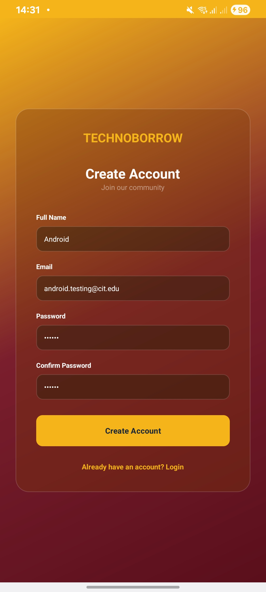
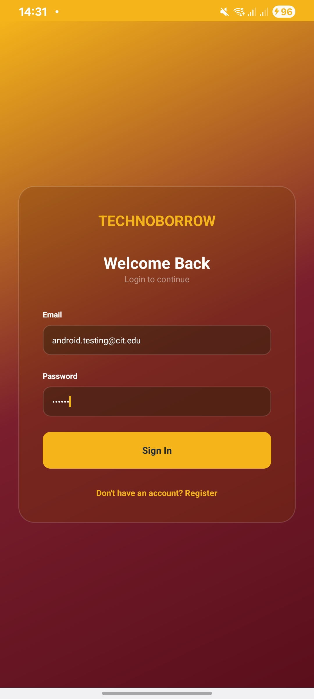
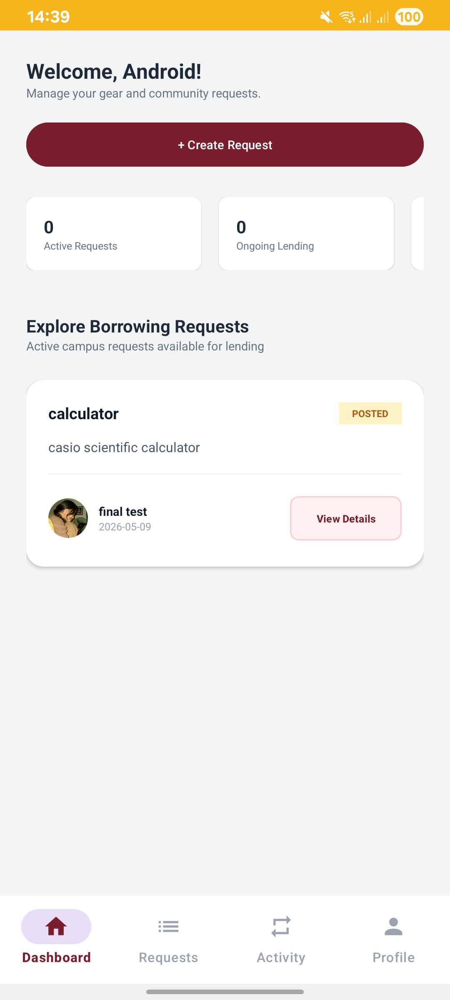
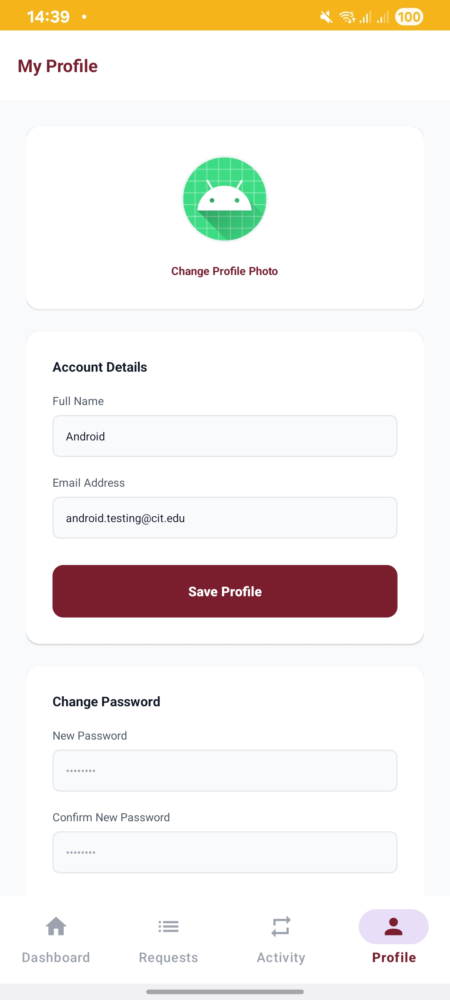

# TechnoBorrow Mobile Application

## API Documentation

### Register Endpoint
POST /auth/register

### Login Endpoint
POST /auth/login

### Dashboard Endpoint
GET /requests

### Profile Endpoint
GET /profile

### Update Profile Endpoint
PUT /profile

### Change Password Endpoint
PUT /change-password

---

# Screenshots

## Register

## Login

## Dashboard

## Profile

## Update Profile

## Change Password

